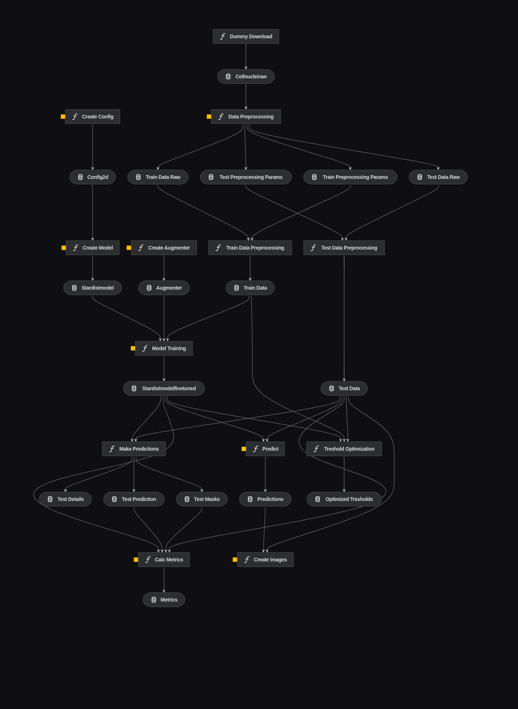
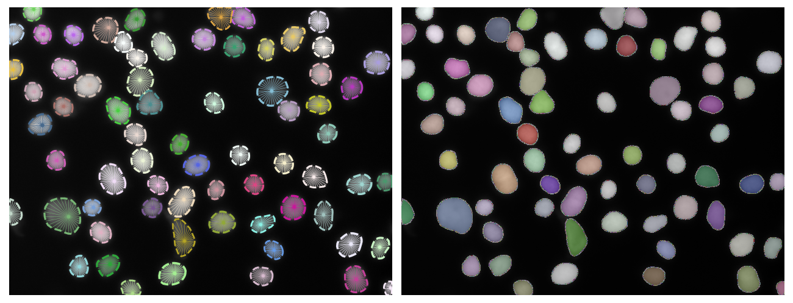

[](https://github.com/Jakub-Kucinski/cell-nuclei-segmentation/actions/workflows/test-action.yml)
# cell-nuclei-segmentation


# Table of Contents
- [cell-nuclei-segmentation](#cell-nuclei-segmentation)
- [Table of Contents](#table-of-contents)
- [Nuclear images dataset](#nuclear-images-dataset)
  - [Sample image and mask](#sample-image-and-mask)
- [Libraries and tools](#libraries-and-tools)
- [Installation](#installation)
  - [Code development](#code-development)
    - [Pre-commit](#pre-commit)
    - [AWS access configuration](#aws-access-configuration)
  - [Running source code](#running-source-code)
    - [Requirements](#requirements)
      - [Docker](#docker)
      - [NVIDIA drivers](#nvidia-drivers)
      - [NVIDIA docker](#nvidia-docker)
    - [Running code](#running-code)
- [Stardist](#stardist)
  - [Papers](#papers)
  - [Short description](#short-description)
- [Kedro](#kedro)
- [Pipelines](#pipelines)
  - [Data download](#data-download)
  - [Data preprocessing](#data-preprocessing)
  - [Data augmentation](#data-augmentation)
  - [Model training](#model-training)
  - [Model evaluation](#model-evaluation)
  - [Results visualization](#results-visualization)
- [Results](#results)
  - [Metrics](#metrics)
  - [Example visualization](#example-visualization)

# Nuclear images dataset
[An annotated fluorescence image dataset for training nuclear segmentation methods](https://www.ebi.ac.uk/biostudies/bioimages/studies/S-BSST265)


|  |  |
| -------- | -------- |
| Accession     | S-BSST265     |
| Description     | This dataset contains annotated fluorescent nuclear images of different tissue origins and sample preparation types and can be used to train machine-learning based nuclear image segmentation algorithms.     |
| Organism     | Homo sapiens     |
| Experimental design     | Preparation and immunofluorescence (IF) staining of different human cell and tissue types. Samples of in vitro cultivated normal and neuroblastoma human cell line, bone marrow and fresh primary tumor of neuroblastoma patients, and freshly frozen tumor tissue of a ganglioneuroma patient were processed properly for further IF stainings. At each staining, 4, 6-diamino-2-phenylindole (DAPI), a blue fluorescent dye, conventionally used for cellular imaging techniques, was applied to stain the nuclei. Microscopy images were acquired and subjected to nuclear image annotation by biology and pathology experts.     |

## Sample image and mask


# Libraries and tools
- [StarDist](https://github.com/stardist/stardist) - library for 2D/3D instance segmentation with star-convex shaped objects
- [Kedro](https://kedro.org/) - framework for reproducible, maintainable and modular data science code
- [AWS S3](https://aws.amazon.com/s3/) - storing and downloading models
- [DVC](https://dvc.org/) - models versioning
- [pytest](https://docs.pytest.org/en/stable/) - testing
- [pre-commit](https://pre-commit.com/) - code formatting and linting
- [Docker](https://www.docker.com/) - containerization

# Installation

## Code development
For developing the code we suggest creating a virtual environment with conda using the provided [conda.yml](conda.yml) file, which contains pre-commit with linting and formatting tools and dvc[s3] for storing and downloading models from AWS S3.
```shell
conda env create -f conda.yml
conda activate cell-nuclei-segmentation
```

### Pre-commit

To check all files with linting and formatting tools without committing changes simply run:
```shell
pre-commit run --all-files
```

### AWS access configuration

```shell
export AWS_SHARED_CREDENTIALS_FILE="$(pwd)/conf/local/aws/credentials"
export AWS_CONFIG_FILE="$(pwd)/conf/base/aws/config"
export LOCAL_PROFILE_NAME={profile_name}
export AWS_PROFILE=$LOCAL_PROFILE_NAME
aws configure set aws_access_key_id {aws_access_key_id} --profile $LOCAL_PROFILE_NAME
aws configure set aws_secret_access_key {aws_secret_access_key} --profile $LOCAL_PROFILE_NAME
```

## Running source code
Source code is meant to be run in a Docker container and requires NVIDIA drivers and NVIDIA docker to be installed.

### Requirements

#### Docker

https://docs.docker.com/engine/install/ubuntu/#installation-methods

#### NVIDIA drivers
As StarDist uses tensorflow:2.3 which requires CUDA TODO, we recommend installing NVIDIA drivers version TODO.
https://docs.nvidia.com/datacenter/tesla/tesla-installation-notes/index.html#ubuntu-lts

#### NVIDIA docker

https://docs.nvidia.com/datacenter/cloud-native/container-toolkit/install-guide.html#setting-up-nvidia-container-toolkit

### Running code
Build docker image:
```shell
docker compose build
docker compose run segmentation
```
Run code inside docker container e.g. by running the whole workflow:
```shell
kedro run
```
For detailed information about running specific pipelines see [Pipelines](#pipelines) section.

# Stardist

## Papers


- Uwe Schmidt, Martin Weigert, Coleman Broaddus, and Gene Myers.
[*Cell Detection with Star-convex Polygons*](https://arxiv.org/abs/1806.03535).
International Conference on Medical Image Computing and Computer-Assisted Intervention (MICCAI), Granada, Spain, September 2018.

- Martin Weigert, Uwe Schmidt, Robert Haase, Ko Sugawara, and Gene Myers.
[*Star-convex Polyhedra for 3D Object Detection and Segmentation in Microscopy*](http://openaccess.thecvf.com/content_WACV_2020/papers/Weigert_Star-convex_Polyhedra_for_3D_Object_Detection_and_Segmentation_in_Microscopy_WACV_2020_paper.pdf).
The IEEE Winter Conference on Applications of Computer Vision (WACV), Snowmass Village, Colorado, March 2020


## Short description
Copied from [Stardist repository](https://github.com/stardist/stardist).

The following figure illustrates the general approach for 2D images. The training data consists of corresponding pairs of input (i.e. raw) images and fully annotated label images (i.e. every pixel is labeled with a unique object id or 0 for background).
A model is trained to densely predict the distances (r) to the object boundary along a fixed set of rays and object probabilities (d), which together produce an overcomplete set of candidate polygons for a given input image. The final result is obtained via non-maximum suppression (NMS) of these candidates.


# Kedro
[Kedro](https://kedro.org/) is a framework for creating reproducible, maintainable and modular data science code. It allows to create pipelines, that can be run in a single command. It also provides a visualization of the pipelines, which can be seen below.

# Pipelines
To run the whole workflow, you can use the following command:
```shell
kedro run
```

## Data download
[Nuclear images dataset](https://www.ebi.ac.uk/biostudies/bioimages/studies/S-BSST265) can be downloaded manually or with usage of `data_download` pipeline from website.
```shell
kedro run --pipeline data_download
```

## Data preprocessing
`data_processing` pipeline requires that the data has already been downloaded (check [Dataset download](#data-download) section). It preprocess the raw data based on the [data_preprocessing.yml](conf/base/parameters/data_preprocessing.yml) config file.
```shell
kedro run --pipeline data_processing
```

## Data augmentation
`data_augmentations` pipeline creates the `Augmenter` object, that is later used during `model_training` stage. Used augmentations are based on the [data_augmentations.yml](conf/base/parameters/data_augmentations.yml) config file.
```shell
kedro run --pipeline data_augmentations
```

## Model training
`model_training` pipeline creates model based on specified configuration in the [model_config.yml](conf/base/parameters/model_config.yml) config file. You can use pretrained model (then you also need to specify the existing name of pretrained model - available ones can be found on [stardist github](https://github.com/stardist/stardist#pretrained-models-for-2d)) and choose whether to finetune it or not or to train it entirely from scratch.
```shell
kedro run --tag model_training
```

## Model evaluation
`model_evaluation` pipeline evaluates the model on the metrics specified in the [model_evaluation.yml](conf/base/parameters/model_evaluation.yml) config file. It uses the model created during `model_training` stage.
```shell
kedro run --tag model_validation
```

## Results visualization
`results_visualization` pipeline makes predictions on the images listed in [results_visualization.yml](conf/base/parameters/results_visualization.yml) config file. It uses the model created during `model_training` stage. Visualizations are being saved in the [data/08_reporting/imgs](data/08_reporting/imgs) folder.

```shell
kedro run --tag results_visualization
```

# Results
## Metrics
- F1 score: 0.88
- IoU: 0.79
- mAP: 0.54

## Example visualization
Predictions vs groundtruth

